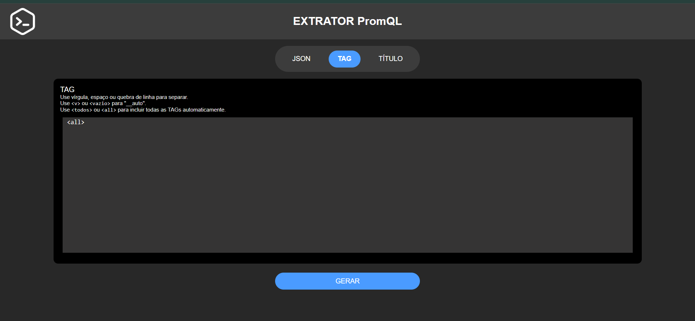
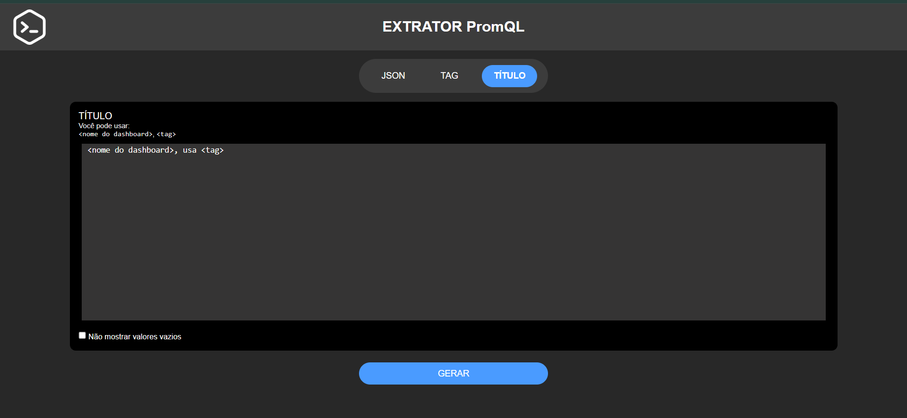
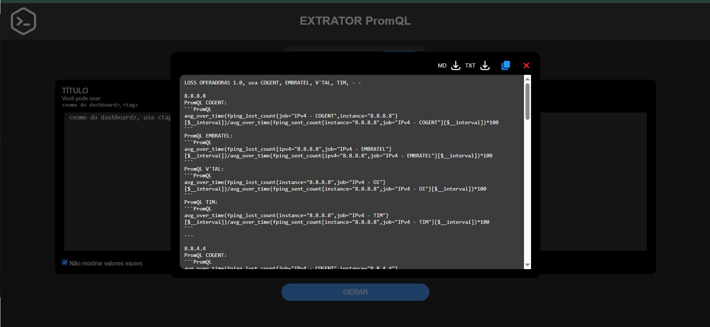

  <a href="#extrator-pt-br">🇧🇷 Português-BR</a> |
  <a href="#extrator-en">🇺🇸 English</a> |
  <a href="#extrator-imgs">IMAGENS / IMAGES</a>

---

# EXTRATOR — Versão 1.1.0

---

## 🇧🇷 EXTRATOR (PT-BR) 

EXTRATOR é uma ferramenta web avançada para extrair de forma inteligente e formatada expressões **PromQL** e **coletas Zabbix** de dashboards exportados do **Grafana**.

---

### 🎯 Objetivo do Projeto
Proporcionar uma experiência moderna e automatizada para leitura e auditoria de dashboards Grafana, permitindo a extração de dados estruturados para Prometheus e Zabbix com extrema facilidade.

---

### 🛠️ Finalidade
Ideal para:

- Engenheiros de redes
- Analistas de observabilidade
- Equipes NOC/SRE que mantêm dashboards em ambientes críticos

---

### 🆕 Novidades da versão 1.1.0

- 🧠 **Suporte completo a Zabbix Datasource**
- 🧾 Extração dos campos: `refId`, `host`, `group`, `item`, `setAlias`
- 📌 Exibição agrupada por **painel**
- 🧼 Saída padronizada tanto para Prometheus quanto para Zabbix
- 🔎 Ignora campos vazios automaticamente com opção via checkbox
- ✍️ Identificação clara do nome do painel no início de cada bloco
- 🌐 Ainda mais robusto, leve e responsivo

---

### ⚙️ O que o EXTRATOR faz?

- Lê arquivos JSON exportados do Grafana
- Detecta e separa painéis por datasource:
  - `Prometheus`
  - `Zabbix`
- Extrai expressões e dados de forma estruturada
- Permite selecionar quais **TAGs** buscar
- Gera uma saída limpa, formatada e fácil de copiar ou baixar
- Suporte `.txt`, `.md` e botão de copiar com feedback visual

---

### 🚀 Benefícios Práticos

- **Economia de tempo**
- **Padronização de relatórios**
- **Análise rápida e offline**
- **Zero dependências externas**
- **Interface mobile e desktop friendly**

---

### 🧱 Tecnologias Utilizadas

- HTML5 + CSS3
- JavaScript Vanilla
- Layout inspirado em UI/UX modernos (Figma)

---

### 📌 Limitações atuais

- Apenas dashboards do Grafana (JSON exportado)
- Suporte apenas a datasources do tipo:
  - `Prometheus`
  - `Zabbix`

---

### 💡 Exemplos de uso

- Auditoria de coletas de interface
- Documentação técnica padronizada
- Comparação entre diferentes datasources
- Geração de relatórios de saúde (perda de pacotes, latência)

---

## 🇺🇸 EXTRATOR (EN) 

**EXTRATOR** is a powerful web-based tool to intelligently extract and format **PromQL** expressions and **Zabbix collection data** from exported **Grafana dashboards**.

---

### 🎯 Project Goal

Deliver a modern, automated experience for reading and auditing Grafana dashboards. It enables clean, structured data extraction for both Prometheus and Zabbix.

---

### 🛠️ Purpose

Ideal for:

- Network engineers
- Observability and SRE teams
- NOC analysts managing production dashboards

---

### 🆕 What's New in Version 1.1.0

- 🧠 Full support for Zabbix datasource
- 🧾 Extraction of: `refId`, `host`, `group`, `item`, `setAlias`
- 📌 Outputs grouped by **panel name**
- 🧼 Unified formatting for Prometheus and Zabbix blocks
- 🔍 Optional checkbox to hide empty fields
- ✍️ Each section clearly identifies its source panel
- 🌐 Lightweight, responsive, no backend required

---

### ⚙️ What it does

- Parses exported Grafana JSON
- Detects both Prometheus and Zabbix targets
- Extracts PromQL and Zabbix collection info
- Allows filtering by TAGs
- Generates well-formatted output
- Provides download (.txt, .md) and copy buttons with visual feedback

---

### 🚀 Practical Benefits

- Saves hours of manual work
- Standardizes reports
- Fast, responsive interface
- No external dependencies
- Works fully offline in the browser

---

### 🧱 Tech Stack

- HTML5 + CSS3
- Vanilla JavaScript
- Figma-inspired design

---

### 📌 Current Limitations

- Works only with **Grafana dashboards**
- Supports only `Prometheus` and `Zabbix` datasources

---

### 💡 Use Cases

- Interface health reports
- Metric auditing and documentation
- Comparing Prometheus and Zabbix coverage
- Report generation for teams or stakeholders

---

## IMAGENS / IMAGES 

---
