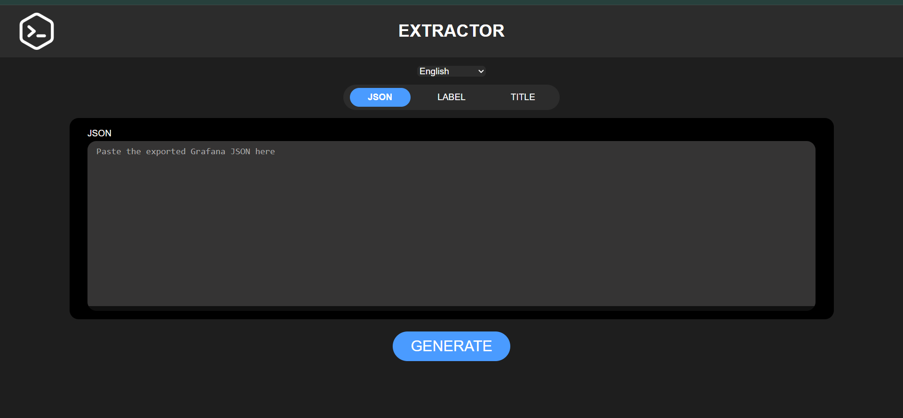
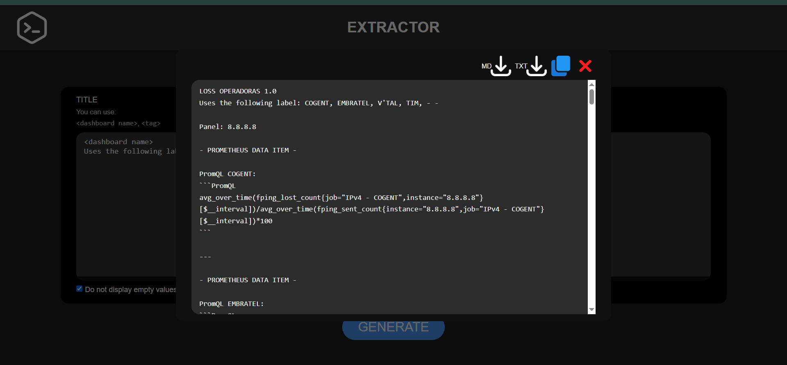

  <a href="#extrator-pt-br">🇧🇷 Português-BR</a> |
  <a href="#extrator-en">🇺🇸 English</a> |
  <a href="#extrator-imgs">IMAGENS / IMAGES</a>

---

# EXTRATOR — Versão 3.0.0

---

## 🇧🇷 EXTRATOR (PT-BR) 

**EXTRATOR** é uma ferramenta web avançada para extrair de forma inteligente e formatada expressões **PromQL** e dados de coleta **Zabbix** a partir de dashboards exportados do **Grafana**, agora com suporte multilíngue e filtros otimizados por **labels**.

---

### 🎯 Objetivo do Projeto
Modernizar a auditoria de dashboards Grafana, oferecendo uma experiência interativa e multilíngue com extração detalhada de dados Prometheus e Zabbix.

---

### 🛠️ Finalidade
Ideal para:

- Engenheiros de redes
- Equipes NOC/SRE
- Times de observabilidade e infraestrutura crítica

---

### 🆕 Novidades da versão 3.0.0

- 🌐 **Suporte multilíngue (EN / PT-BR)**
- 🏷️ **Unificação de Tags como Labels**, aplicável a:
  - `legendFormat` e `refId` (Prometheus)
  - `setAlias` e `refId` (Zabbix)
- 🧠 **Filtro por Label** mais inteligente e centralizado
- 🧼 **Saída formatada com tradução dinâmica** por idioma
- 🧾 Novo placeholder `<label>` para título/template
- 🔄 Interface reativa sem recarregar a página
- ✍️ Melhorias visuais e textuais na UI

---

### ⚙️ O que o EXTRATOR faz?

- Lê arquivos JSON exportados do Grafana
- Identifica painéis com datasource `Prometheus` e `Zabbix`
- Extrai:
  - Prometheus: `expr`, `legendFormat`, `refId`
  - Zabbix: `refId`, `group`, `host`, `item`, `setAlias`
- Filtra por **Labels personalizadas**
- Gera relatório formatado com agrupamento por painel
- Exporta como `.txt`, `.md` ou cópia rápida

---

### 🚀 Benefícios Práticos

- Elimina trabalho manual repetitivo
- Facilita auditoria e documentação técnica
- Funciona offline
- Visual clean e responsivo
- Tradução dinâmica da interface e saída

---

### 🧱 Tecnologias Utilizadas

- HTML5 + CSS3
- JavaScript Vanilla (ES Modules)
- Arquitetura modular (MVC + Hexagonal)
- Interface multilíngue com `supportLanguages.js`

---

### 📌 Limitações atuais

- Apenas dashboards Grafana (`.json`)
- Datasources suportados:
  - `Prometheus`
  - `Zabbix`

---

### 💡 Exemplos de uso

- Auditoria de coletas e métricas
- Validação de dashboards técnicos
- Padronização de relatórios para NOC/SRE
- Comparativo entre Prometheus e Zabbix

---

## 🇺🇸 EXTRATOR (EN) 

**EXTRATOR** is a powerful web tool for intelligently extracting and formatting **PromQL** and **Zabbix collection data** from **Grafana dashboards**, now with multilingual support and advanced label filtering.

---

### 🎯 Project Goal

Provide a modern, interactive interface for auditing Grafana dashboards with structured Prometheus and Zabbix data extraction — now in English and Portuguese-BR.

---

### 🛠️ Purpose

Built for:

- Network Engineers
- NOC / SRE teams
- Observability professionals

---

### 🆕 What's New in Version 3.0.0

- 🌐 **Multilanguage Support (EN / PT-BR)**
- 🏷️ **Unified Labels** for filtering:
  - `legendFormat` and `refId` (Prometheus)
  - `setAlias` and `refId` (Zabbix)
- 🧠 **Smarter label filtering**
- 📌 Formatted output translated dynamically
- ✍️ New `<label>` placeholder (replacing `<tag>`)
- ⚡ Reactive UI with no page reload
- 📎 Improved UI/UX experience

---

### ⚙️ What It Does

- Parses `.json` dashboards exported from Grafana
- Detects both Prometheus and Zabbix targets
- Extracts:
  - Prometheus: `expr`, `legendFormat`, `refId`
  - Zabbix: `refId`, `group`, `host`, `item`, `setAlias`
- Filters by custom **labels**
- Outputs grouped and translated reports
- Exportable as `.txt`, `.md`, or copied to clipboard

---

### 🚀 Practical Benefits

- Reduces manual dashboard audits
- Creates consistent technical reports
- Works entirely offline
- Multilingual support without reload

---

### 🧱 Built With

- HTML5 + CSS3
- Vanilla JS (ES Modules)
- MVC + Hexagonal architecture
- `supportLanguages.js` for dynamic i18n

---

### 📌 Current Limitations

- Only works with Grafana `.json` dashboards
- Supports `Prometheus` and `Zabbix` datasources

---

### 💡 Use Cases

- Metric auditing
- Zabbix / Prometheus validation
- Internal documentation
- Report standardization for critical teams

---

## IMAGENS / IMAGES 

### Página JSON

### Página LABEL

### Página TÍTULO

### Página SAÍDA

---

🛠 Projeto desenvolvido e mantido por **@ghabrielsoares**
