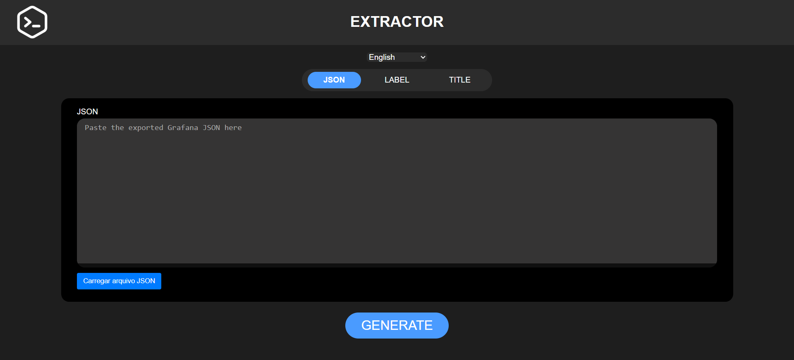
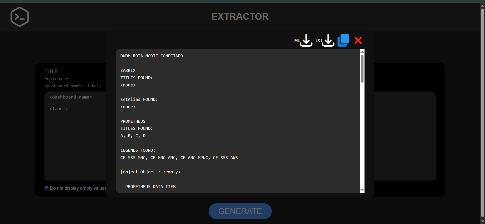

  <a href="#extrator-pt-br">🇧🇷 Português-BR</a> |
  <a href="#extrator-en">🇺🇸 English</a> |
  <a href="#extrator-imgs">IMAGENS / IMAGES</a>

---

# EXTRATOR — Versão 3.1.0

---

## 🇧🇷 EXTRATOR (PT-BR) 

**EXTRATOR** é uma ferramenta web avançada para extrair de forma inteligente e formatada expressões **PromQL** e dados de coleta **Zabbix** a partir de dashboards exportados do **Grafana**, com suporte multilíngue, filtros otimizados por **labels** e interface interativa.

---

### 🎯 Objetivo do Projeto
Modernizar a auditoria de dashboards Grafana, oferecendo uma experiência fluida, offline, multilíngue e automatizada para extração de métricas Prometheus e Zabbix.

---

### 🛠️ Finalidade
Ideal para:

- Engenheiros de redes
- Equipes NOC/SRE
- Times de observabilidade e infraestrutura crítica

---

### 🆕 Novidades da versão 3.1.0

- 📎 **Upload de arquivo JSON por botão ou arrastar & soltar**
- 💾 **Conteúdo do arquivo armazenado internamente**, sem sobrescrever o campo de texto
- 🧩 **Preview visual do anexo**
- 🧠 Campo de texto permanece disponível para edição manual opcional
- 💡 Ajustes visuais e feedback durante o "drag & drop"
- 🔁 Arquitetura mantida: **MVC + Hexagonal**

---

### ⚙️ O que o EXTRATOR faz?

- Lê arquivos JSON exportados do Grafana
- Identifica painéis com datasource `Prometheus` e `Zabbix`
- Extrai:
  - Prometheus: `expr`, `legendFormat`, `refId`
  - Zabbix: `refId`, `group`, `host`, `item`, `setAlias`
- Filtra por **Labels personalizadas**
- Gera relatório formatado com agrupamento por painel
- Exporta como `.txt`, `.md` ou cópia rápida

---

### 🚀 Benefícios Práticos

- Elimina trabalho manual repetitivo
- Facilita auditoria e documentação técnica
- Funciona offline
- Interface responsiva e multilíngue

---

### 🧱 Tecnologias Utilizadas

- HTML5 + CSS3
- JavaScript (ES Modules)
- Arquitetura modular (MVC + Hexagonal)
- Interface multilíngue com `supportLanguages.js`

---

### 📌 Limitações atuais

- Apenas dashboards Grafana (`.json`)
- Datasources suportados:
  - `Prometheus`
  - `Zabbix`

---

### 💡 Exemplos de uso

- Auditoria de coletas e métricas
- Validação de dashboards técnicos
- Padronização de relatórios para NOC/SRE
- Comparativo entre Prometheus e Zabbix

---

## 🇺🇸 EXTRATOR (EN) 

**EXTRATOR** is a powerful web tool for intelligently extracting and formatting **PromQL** and **Zabbix** data from **Grafana dashboards**, now with drag & drop support and advanced internal JSON handling.

---

### 🎯 Project Goal

Provide a modern, interactive interface for auditing Grafana dashboards with structured Prometheus and Zabbix extraction — fully offline, multilingual, and user-friendly.

---

### 🛠️ Purpose

Designed for:

- Network Engineers
- NOC / SRE teams
- Infrastructure & Observability professionals

---

### 🆕 What's New in Version 3.1.0

- 📎 **Drag & drop JSON support**,
- 📂 **Upload via button or drop area**
- 🧠 JSON content is stored in memory (not overwritten in text box)
- 🧾 **File preview UI** with `<>` icon and filename
- ✍️ Text area remains available for manual edits
- 🔁 Maintains clean **MVC + Hexagonal** architecture

---

### ⚙️ What It Does

- Parses `.json` dashboards exported from Grafana
- Detects Prometheus and Zabbix targets
- Extracts:
  - Prometheus: `expr`, `legendFormat`, `refId`
  - Zabbix: `refId`, `group`, `host`, `item`, `setAlias`
- Filters by custom **labels**
- Outputs grouped and translated reports
- Exportable as `.txt`, `.md`, or copied to clipboard

---

### 🚀 Practical Benefits

- Reduces manual dashboard audits
- Creates consistent technical documentation
- Fully offline and lightweight
- Multilingual interface
- Modern UX, drag-and-drop friendly

---

### 🧱 Built With

- HTML5 + CSS3
- Vanilla JS (ES Modules)
- MVC + Hexagonal Architecture
- `supportLanguages.js` for i18n

---

### 📌 Current Limitations

- Only supports Grafana `.json` dashboards
- Prometheus and Zabbix datasources only

---

### 💡 Use Cases

- Metric auditing
- Zabbix / Prometheus validation
- Technical documentation generation
- Dashboard inspection for critical environments

---

## IMAGENS / IMAGES 

### Página JSON

### Página LABEL

### Página TÍTULO

### Página SAÍDA

---

🛠 Projeto desenvolvido e mantido por: **@ghabrielsoares**
